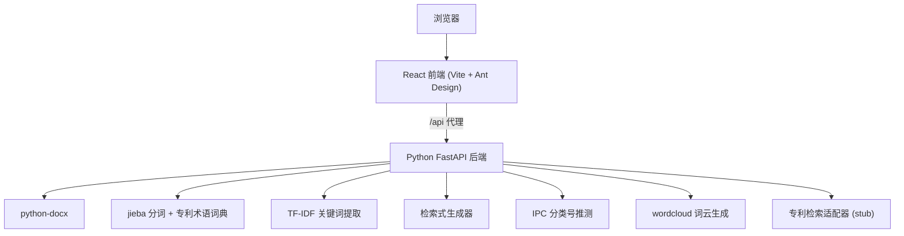
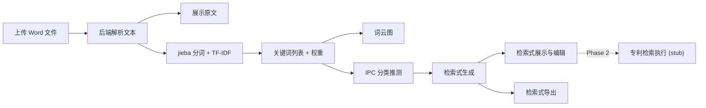
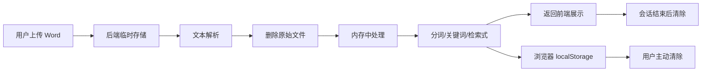

# 专利交底书关键词统计与检索式生成工具

Feature Name: patent-keyword-search
Updated: 2026-06-29

## 描述

基于 Web 的专利交底书智能分析工具。第一期实现 Word 文档上传、关键词提取统计、词云可视化、IPC 分类号自动推测、检索式生成与导出功能。专利检索 API 调用部分预留接口（stub），第二期对接实际数据库。

## 架构

### 整体架构



### 数据流



## 组件与接口

### 前端（React + Vite + TypeScript）

#### 页面结构

| 页面 | 路由 | 功能 |
|------|------|------|
| 上传分析页 | `/` | 文件上传、原文预览、关键词展示、词云图 |
| 检索式页面 | `/search-query` | 检索式生成、编辑、选择 |
| 检索结果页 | `/results` | 专利列表、详情展开、导出 |
| 历史记录页 | `/history` | 本地历史记录管理 |

#### 组件树

- `App`
  - `UploadPanel` - 文件上传区域
  - `TextPreview` - 交底书原文展示（含关键词高亮）
  - `KeywordTable` - 关键词表格（含勾选）
  - `WordCloud` - 词云可视化
  - `SearchQueryEditor` - 检索式编辑器
  - `SearchProgress` - 检索进度指示
  - `PatentResultList` - 专利结果列表
  - `PatentDetail` - 专利详情展开面板
  - `HistoryList` - 检索历史列表

#### 状态管理

使用 React Context + useReducer 管理全局状态：

```
AppState {
  file: File | null
  textContent: string
  keywords: Keyword[]
  selectedKeywordIds: Set<string>
  searchQueries: SearchQuery[]
  activeQuery: SearchQuery | null
  patentResults: PatentResult[]
  searchStatus: 'idle' | 'searching' | 'done' | 'error'
  error: string | null
}
```

#### API 接口（前端调用）

| 方法 | 路径 | 说明 |
|------|------|------|
| POST | `/api/upload` | 上传 Word 文件，返回解析文本 |
| POST | `/api/keywords` | 提交文本，返回关键词列表 |
| POST | `/api/wordcloud` | 提交关键词，返回词云图片(base64) |
| POST | `/api/search-queries` | 提交关键词和文本，返回 IPC 推测结果和检索式列表 |
| POST | `/api/search` | 提交检索式，执行专利检索 (stub) |
| GET  | `/api/patent/{id}` | 获取单条专利详情 |

#### Vite 代理配置

```typescript
// vite.config.ts
export default defineConfig({
  server: {
    proxy: {
      '/api': {
        target: 'http://localhost:8000',
        changeOrigin: true,
      }
    }
  }
})
```

### 后端（Python FastAPI）

#### 目录结构

```
backend/
  main.py              # FastAPI 入口
  requirements.txt
  config.py            # 配置文件
  routers/
    upload.py          # 文件上传路由
    keywords.py        # 关键词提取路由
    search.py          # 检索相关路由
  services/
    doc_parser.py      # Word 文档解析
    keyword_extractor.py  # 关键词提取 (jieba + TF-IDF)
    query_generator.py    # 检索式生成
    ipc_predictor.py      # IPC 分类号推测
    wordcloud_gen.py      # 词云生成
    patent_search.py      # 专利检索适配器 (stub, Phase 2)
  data/
    stopwords.txt      # 停用词表
    patent_terms.txt   # 专利术语词典
    ipc_index.json     # IPC 分类号索引
```

#### 核心模块设计

##### doc_parser.py - 文档解析

```python
from docx import Document

def parse_docx(file_path: str) -> str:
    """解析 .docx 文件，提取正文、表格、页眉页脚文本"""
    doc = Document(file_path)
    parts = []

    # 正文段落
    for para in doc.paragraphs:
        if para.text.strip():
            parts.append(para.text)

    # 表格
    for table in doc.tables:
        for row in table.rows:
            row_text = [cell.text for cell in row.cells]
            parts.append(' '.join(row_text))

    # 页眉页脚
    for section in doc.sections:
        for para in section.header.paragraphs:
            if para.text.strip():
                parts.append(para.text)
        for para in section.footer.paragraphs:
            if para.text.strip():
                parts.append(para.text)

    return '\n'.join(parts)
```

##### keyword_extractor.py - 关键词提取

使用 jieba 分词 + 专利术语词典 + TF-IDF：

```python
import jieba
from sklearn.feature_extraction.text import TfidfVectorizer

class KeywordExtractor:
    def __init__(self):
        self._load_patent_dict()
        self._load_stopwords()

    def _load_patent_dict(self):
        """加载专利术语词典"""
        jieba.load_userdict('data/patent_terms.txt')

    def extract(self, text: str, top_n: int = 30) -> list[dict]:
        """提取关键词及权重"""
        # 分句作为 TF-IDF 文档集
        sentences = self._split_sentences(text)
        # TF-IDF 计算
        vectorizer = TfidfVectorizer(
            tokenizer=self._jieba_tokenize,
            max_features=top_n * 2,
            stop_words=self.stopwords
        )
        tfidf_matrix = vectorizer.fit_transform(sentences)
        # 汇总权重
        ...
        return [{"word": w, "count": c, "weight": wt} for w, c, wt in ...]
```

##### query_generator.py - 检索式生成

生成策略：
1. **核心词 AND 组合**：将权重最高的 3-5 个关键词用 AND 连接
2. **扩展 OR 组合**：每个核心词配上同义/近义扩展词，用 OR 包裹
3. **IPC 分类号限定**：基于关键词推测 IPC 分类，加入检索式前缀
4. **宽泛检索式**：仅用 2 个最核心词 AND 组合

输出格式需适配不同数据库：

| 数据库 | 语法示例 |
|--------|---------|
| Espacenet | `(deep AND learning) AND (neural OR network)` |
| Google Patents | `"deep learning" "neural network"` |
| CNIPA | `(深度学习) AND (神经网络)` |

##### ipc_predictor.py - IPC 分类号推测

基于关键词与 IPC 分类描述之间的语义匹配，推测最可能的 IPC 分类号：

```python
class IPCPredictor:
    def __init__(self, ipc_index_path: str = 'data/ipc_index.json'):
        self.ipc_entries = self._load_ipc_index(ipc_index_path)

    def predict(self, keywords: list[str], top_n: int = 5) -> list[dict]:
        """
        基于关键词匹配 IPC 分类号
        ipc_index.json 结构:
        [
          {"code": "G06N3/08", "description": "学习算法"},
          {"code": "G06F16/00", "description": "信息检索"},
          ...
        ]
        """
        scores = []
        for entry in self.ipc_entries:
            score = sum(
                1 for kw in keywords
                if kw in entry['description']
            ) / len(keywords)
            if score > 0:
                scores.append({"code": entry['code'], "desc": entry['description'], "score": score})
        scores.sort(key=lambda x: x['score'], reverse=True)
        return scores[:top_n]
```

##### patent_search.py - 专利检索适配器 (stub, Phase 2)

```python
class PatentSearchAdapter:
    """Phase 1: 返回模拟数据，验证整体流程。Phase 2: 对接真实 API。"""
    async def search_all(self, query: str, databases: list[str]) -> dict:
        return {
            db: {"results": [], "total": 0, "error": "检索功能将在第二期实现"}
            for db in databases
        }
```

#### API 路由设计

```python
# main.py
from fastapi import FastAPI, UploadFile, File
from fastapi.middleware.cors import CORSMiddleware

app = FastAPI(title="专利交底书分析工具")

@app.post("/api/upload")
async def upload_file(file: UploadFile = File(...)):
    """上传 Word 文件，返回解析文本"""
    ...

@app.post("/api/keywords")
async def extract_keywords(request: KeywordRequest):
    """提取关键词"""
    ...

@app.post("/api/search-queries")
async def generate_queries(request: QueryRequest):
    """生成检索式"""
    ...

@app.post("/api/search")
async def search_patents(request: SearchRequest):
    """执行专利检索"""
    ...
```

## 数据模型

### 前端状态类型

```typescript
interface Keyword {
  id: string
  word: string
  count: number
  weight: number  // TF-IDF 权重 (0-1)
}

interface SearchQuery {
  id: string
  strategy: string       // 检索策略名称
  queryText: string       // 检索式文本
  targetDbs: string[]    // 目标数据库
  ipcCodes: string[]     // 关联的 IPC 分类号
  editable: boolean
}

interface PatentResult {
  id: string
  patentNumber: string   // 专利号
  title: string
  applicant: string      // 申请人
  filingDate: string     // 申请日
  abstract: string       // 摘要
  source: string         // 来源数据库
  relevance: number      // 相关度 (0-100)
  url: string            // 专利原文链接
}

interface SearchHistory {
  id: string
  timestamp: number
  fileName: string
  keywords: Keyword[]
  searchQueries: SearchQuery[]
  resultCounts: Record<string, number>
}
```

### 后端数据模型

```python
from pydantic import BaseModel

class KeywordRequest(BaseModel):
    text: str
    top_n: int = 30

class KeywordResponse(BaseModel):
    keywords: list[dict]  # [{word, count, weight}]

class QueryRequest(BaseModel):
    text: str
    keywords: list[str]

class QueryResponse(BaseModel):
    ipc_predictions: list[dict]  # [{code, desc, score}]
    queries: list[dict]  # [{id, strategy, queryText, targetDbs, ipcCodes}]

class SearchRequest(BaseModel):
    query_id: str
    query_text: str
    databases: list[str]  # ['cnipa', 'espacenet', 'google']

class SearchResponse(BaseModel):
    results: dict[str, list[dict]]
    total_counts: dict[str, int]
    errors: dict[str, str | None]
```

## 正确性约束

- 分词结果中不得包含停用词表中的词汇
- TF-IDF 权重必须在 [0, 1] 区间内归一化
- 检索式生成必须包含至少 2 个关键词
- 专利结果列表必须按相关度降序排列
- 同一专利号在去重后的结果中不得重复出现
- 文件上传大小不得超过 20MB

## 数据安全设计

### 安全原则

交底书属于未公开技术秘密，系统从架构层面实现数据隔离。第一期所有处理均在本地完成，无任何数据外传路径。

### 数据生命周期



### 各阶段安全措施

| 阶段 | 措施 |
|------|------|
| 上传 | 仅接受 .doc/.docx，大小限制 20MB，校验文件 MIME 类型 |
| 存储 | 写入临时目录（`/tmp/patent-tool/`），设置 600 权限 |
| 解析 | 读取后立即 `os.remove()` 删除原始文件 |
| 处理 | 文本、关键词、检索式数据仅存于进程内存，不落盘 |
| 传输 | 前后端通信仅走 `localhost` 回环，不经过网卡 |
| 前端 | History 存 `localStorage`，不上传服务器；无 Cookie/Token 追踪 |
| 清理 | 后端会话过期或重启后内存数据自动释放 |

### 第二期安全扩展

| 措施 | 说明 |
|------|------|
| 检索式脱敏 | 仅发送检索式文本至外部 API，不附带交底书原文 |
| 用户提示 | API 调用前弹窗告知"即将向外部服务发送检索式"，用户确认后执行 |
| 传输加密 | 外部 API 调用强制使用 HTTPS |

## 错误处理

| 场景 | 处理策略 |
|------|---------|
| 文件格式错误 | 返回 400 + 明确错误提示 |
| 文件过大 | 返回 413 + 提示文件大小限制 |
| 分词失败 | 返回 500 + 显示"分析失败，请重试" |
| 某个数据库检索超时 | 记录错误，继续返回其他数据库结果 |
| 所有数据库检索失败 | 返回 503 + 提示用户稍后重试 |
| 网络断开 | 前端显示离线提示，阻止操作 |

## 测试策略

### 单元测试
- doc_parser: 使用示例 .docx 文件验证解析完整性
- keyword_extractor: 验证关键词权重排序正确性、停用词过滤
- query_generator: 验证检索式语法正确性、多数据库格式适配
- ipc_predictor: 验证 IPC 分类号推测准确率

### 集成测试
- 完整上传 -> 分析 -> 检索式生成流程验证

### 前端测试
- 组件渲染测试（Vitest + React Testing Library）
- 用户交互流程 E2E 测试（Playwright）

## 技术选型理由

- **FastAPI**: 异步支持、自动 OpenAPI 文档、文件上传原生支持
- **jieba**: 最成熟的中文分词库，支持自定义词典
- **React + Vite**: 快速开发、HMR、TypeScript 原生支持
- **Ant Design**: 丰富的企业级 UI 组件（表格、上传、进度条等）
- **本地存储**: 无需后端数据库，简化部署

## 参考文献

[^1]: Espacenet OPS API - https://developers.epo.org/
[^2]: jieba 分词 - https://github.com/fxsjy/jieba
[^3]: python-docx - https://python-docx.readthedocs.io/
