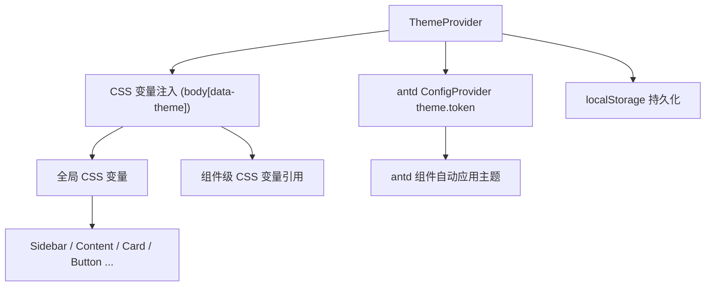
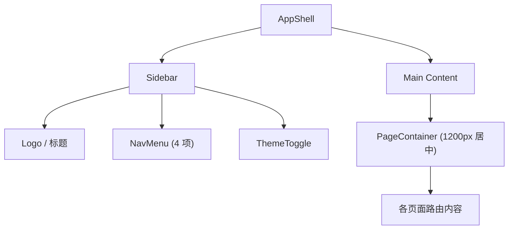
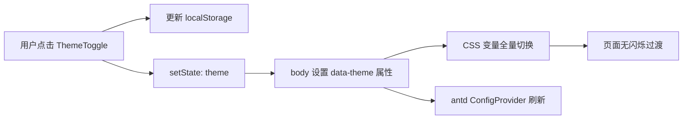

# UI 重设计

Feature Name: ui-redesign
Updated: 2026-06-30

## 描述

对专利交底书分析工具进行全面的 UI 重设计。采用侧边栏导航 + 电光蓝（cyan）强调色的科技感深色主题，支持深色/浅色模式切换。用 CSS 变量驱动全局主题系统，替换 antd 默认样式，统一视觉语言。

## 架构

### 主题系统架构



### 布局架构



### 数据流



## 组件与接口

### 主题系统

#### CSS 变量设计 (design-tokens.css)

定义两套 CSS 变量集合，通过 `[data-theme]` 属性选择器切换：

```css
/* 深色模式 (默认) */
[data-theme="dark"] {
  /* 背景层次 */
  --bg-canvas: #09090f;
  --bg-sidebar: #0c0c18;
  --bg-card: #141425;
  --bg-elevated: #1a1a32;
  --bg-hover: #222244;
  --bg-input: #141425;

  /* 边框 */
  --border-default: rgba(255,255,255,0.06);
  --border-hover: rgba(255,255,255,0.10);
  --border-accent: rgba(6,182,212,0.30);

  /* 文字 */
  --text-primary: #f1f5f9;
  --text-secondary: #94a3b8;
  --text-tertiary: #64748b;
  --text-accent: #22d3ee;

  /* 强调色 (电光蓝) */
  --accent-primary: #06b6d4;
  --accent-hover: #22d3ee;
  --accent-active: #0891b2;
  --accent-bg: rgba(6,182,212,0.10);
  --accent-bg-hover: rgba(6,182,212,0.18);

  /* 语义色 */
  --color-success: #10b981;
  --color-warning: #f59e0b;
  --color-danger: #ef4444;
  --color-info: #3b82f6;

  /* 阴影 */
  --shadow-card: 0 1px 3px rgba(0,0,0,0.4), 0 4px 16px rgba(0,0,0,0.3);
  --shadow-elevated: 0 4px 20px rgba(0,0,0,0.5);
  --shadow-glow: 0 0 20px rgba(6,182,212,0.15);
}

/* 浅色模式 */
[data-theme="light"] {
  --bg-canvas: #f8fafc;
  --bg-sidebar: #ffffff;
  --bg-card: #ffffff;
  --bg-elevated: #ffffff;
  --bg-hover: #f1f5f9;
  --bg-input: #ffffff;

  --border-default: rgba(0,0,0,0.06);
  --border-hover: rgba(0,0,0,0.10);
  --border-accent: rgba(6,182,212,0.40);

  --text-primary: #0f172a;
  --text-secondary: #475569;
  --text-tertiary: #94a3b8;
  --text-accent: #0891b2;

  --accent-primary: #06b6d4;
  --accent-hover: #0891b2;
  --accent-active: #0e7490;
  --accent-bg: rgba(6,182,212,0.08);
  --accent-bg-hover: rgba(6,182,212,0.15);

  --color-success: #059669;
  --color-warning: #d97706;
  --color-danger: #dc2626;
  --color-info: #2563eb;

  --shadow-card: 0 1px 3px rgba(0,0,0,0.06), 0 4px 12px rgba(0,0,0,0.04);
  --shadow-elevated: 0 4px 20px rgba(0,0,0,0.08);
  --shadow-glow: 0 0 16px rgba(6,182,212,0.12);
}
```

#### antd ConfigProvider 集成

```typescript
const getAntdTheme = (mode: 'dark' | 'light') => ({
  token: {
    colorPrimary: '#06b6d4',
    colorBgContainer: mode === 'dark' ? '#141425' : '#ffffff',
    colorBgElevated: mode === 'dark' ? '#1a1a32' : '#ffffff',
    colorBorder: mode === 'dark' ? 'rgba(255,255,255,0.06)' : 'rgba(0,0,0,0.06)',
    colorText: mode === 'dark' ? '#f1f5f9' : '#0f172a',
    colorTextSecondary: mode === 'dark' ? '#94a3b8' : '#475569',
    borderRadius: 8,
    fontFamily: '"Inter", -apple-system, BlinkMacSystemFont, "Segoe UI", Roboto, sans-serif',
    fontSize: 14,
    controlHeight: 36,
  },
  components: {
    Card: {
      borderRadiusLG: 12,
      paddingLG: 24,
    },
    Button: {
      borderRadius: 8,
      controlHeight: 36,
      fontWeight: 500,
    },
    Table: {
      headerBg: mode === 'dark' ? '#0c0c18' : '#f8fafc',
      headerColor: mode === 'dark' ? '#94a3b8' : '#475569',
      rowHoverBg: mode === 'dark' ? 'rgba(6,182,212,0.06)' : 'rgba(6,182,212,0.04)',
    },
    Modal: {
      contentBg: mode === 'dark' ? '#141425' : '#ffffff',
      headerBg: mode === 'dark' ? '#141425' : '#ffffff',
    },
    Tag: {
      defaultBg: mode === 'dark' ? 'rgba(6,182,212,0.10)' : 'rgba(6,182,212,0.08)',
      defaultColor: mode === 'dark' ? '#22d3ee' : '#0891b2',
    },
  },
})
```

### 新增组件

#### ThemeProvider (`components/ThemeProvider.tsx`)

- 职责：提供主题切换的 React Context (`ThemeContext`)
- 状态：`theme: 'dark' | 'light'`
- 副作用：初始化时读取 `localStorage` 和 `prefers-color-scheme`，设置 `document.body.dataset.theme`
- 接口：`{ theme, toggleTheme, setTheme }`

#### ThemeToggle (`components/ThemeToggle.tsx`)

- 职责：渲染主题切换按钮（太阳/月亮图标）
- 交互：点击触发 `toggleTheme`，图标旋转动画
- 样式：圆形按钮、半透明背景、hover 时强调色发光

#### AppShell (`components/AppShell.tsx`)

- 职责：全局布局容器，包含 Sidebar + Content 区域
- 使用 antd `Layout` 组件
- 支持侧边栏折叠（移动端自动折叠）

#### Sidebar (`components/Sidebar.tsx`)

- 职责：侧边栏导航
- 结构：顶部 Logo / 中部 4 个 NavItem / 底部 ThemeToggle
- 样式：固定宽度 220px（展开）/ 64px（折叠），深色半透明背景，右侧细边框
- NavItem 样式：图标左 + 文字右，激活态强调色背景 + 左侧 3px 强调色竖线

#### PageContainer (`components/PageContainer.tsx`)

- 职责：页面内容区包裹容器，统一 1200px 最大宽度 + 水平居中 + padding
- 可接受 `title`、`subtitle`、`backButton` 等可选 props

#### Skeleton (`components/Skeleton.tsx`)

- 职责：骨架屏加载组件，替代 Spin 等待
- 样式：深色主题下低亮度灰色脉冲动画

### 现有组件改造计划

| 组件 | 改动 |
|------|------|
| `App.tsx` | 移除 Header、Layout 代码，改用 AppShell |
| `UploadPanel` | 深色拖拽区样式、发光边框 hover、霓虹图标 |
| `TextPreview` | 代码块风格（深色底 + 语法高亮色）、行号 |
| `KeywordTable` | antd Table 主题 Token 自动适配、进度条改 accent 渐变 |
| `WordCloud` | SVG 渲染色改为从 accent 色系采样的渐变 |
| `SearchQueryEditor` | 卡片分组、优先级徽章、内联编辑优化 |
| `PatentResultList` | 简洁列表、数据库标识色 |
| `HomePage` | Hero 区域、步骤指示器 |
| `SearchQueryPage` | IPC 标签云、筛选器、进度条 |
| `ResultsPage` | 数据库分组卡片、链接打开状态 |
| `HistoryPage` | 时间线布局、深色 Modal、空状态插画 |

### 页面级路由与布局映射

```
/ (HomePage)        → AppShell > PageContainer > HomePage
/search-query       → AppShell > PageContainer > SearchQueryPage
/results            → AppShell > PageContainer > ResultsPage
/history            → AppShell > PageContainer > HistoryPage
```

## 数据模型

### 新增类型

```typescript
// 主题模式
type ThemeMode = 'dark' | 'light'

// Theme Context
interface ThemeContextType {
  theme: ThemeMode
  toggleTheme: () => void
}

// 侧边栏折叠状态（AppContext 扩展）
interface AppState {
  // ...现有字段
  sidebarCollapsed: boolean
}
```

### AppContext 扩展

| Action | 说明 |
|--------|------|
| `TOGGLE_SIDEBAR` | 切换侧边栏折叠状态 |
| `SET_SIDEBAR_COLLAPSED` | 设置侧边栏折叠状态 |

### localStorage 键

| Key | 值 | 说明 |
|-----|-----|------|
| `patent_theme_mode` | `"dark"` 或 `"light"` | 用户选择的主题模式 |
| `patent_search_history` | JSON array | 已有，检索历史 |

## 正确性约束

1. **CSS 变量覆盖**：深色和浅色模式必须为所有 CSS 变量定义值，不得遗漏导致回退到浏览器默认
2. **主题切换原子性**：`data-theme` 属性变更和 antd ConfigProvider 刷新必须在同一帧内完成
3. **持久化优先级**：用户手动选择 > localStorage 缓存 > 系统偏好
4. **对比度合规**：深色模式 `text-primary` vs `bg-card` 对比度 >= 4.5:1
5. **动画互斥**：用户设置了 `prefers-reduced-motion: reduce` 时，全局禁用 CSS transition/animation

## 错误处理

- **localStorage 不可用**（隐私模式等）：Fallback 到系统偏好，切换按钮仍然可用但模式不持久化
- **CSS 变量不被支持**（IE 11）：不处理，最低支持 Chrome/Firefox/Edge
- **antd ConfigProvider 嵌套冲突**：ThemeProvider 的 ConfigProvider 包裹 AppShell，确保不产生嵌套

## 测试策略

### 视觉回归测试
- 使用 Playwright 截图对比深色/浅色模式下各页面的渲染效果
- 对比 antd 组件在自定义主题下的样式正确性

### 功能测试
- 主题切换：localStorage 读写、系统偏好检测、无闪烁切换
- 侧边栏：折叠/展开、激活态高亮、移动端自动折叠
- 响应式：768px 断点下布局切换

### 可访问性测试
- 键盘导航：Tab 遍历所有交互元素
- 对比度检查：使用 axe-core 或 Lighthouse 检查 WCAG AA

### 手动测试清单
- [ ] 深色模式下所有 4 个页面的组件渲染正常
- [ ] 浅色模式下所有 4 个页面的组件渲染正常
- [ ] 模式切换后 antd 组件（Modal、Table、Tag、Collapse）颜色正确
- [ ] 侧边栏在 1440px、1024px、768px、375px 宽度下表现正常
- [ ] hover 动画流畅无卡顿
- [ ] 滚动条样式与主题统一

## 参考资料

[^1]: (Design System) - [Ant Design v6 Custom Theme](https://ant.design/docs/react/customize-theme)
[^2]: (CSS) - [Using CSS custom properties](https://developer.mozilla.org/en-US/docs/Web/CSS/Using_CSS_custom_properties)
[^3]: (CSS) - [prefers-color-scheme](https://developer.mozilla.org/en-US/docs/Web/CSS/@media/prefers-color-scheme)
[^4]: (Accessibility) - [WCAG 2.1 Contrast Minimum](https://www.w3.org/WAI/WCAG21/Understanding/contrast-minimum.html)
[^5]: (Inspiration) - [Linear App Design](https://linear.app)
[^6]: (Inspiration) - [Vercel Design](https://vercel.com/design)
